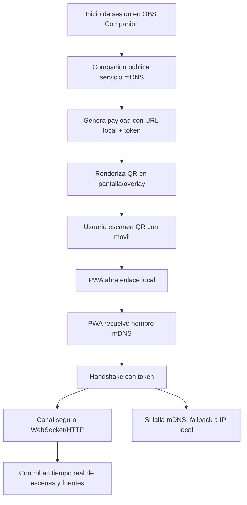

# OBS Orchestra Control - Arquitectura Tecnica y Plan de Archivos

## 1. Diagrama de flujo Zero-Friction (mDNS + QR)



Notas de flujo:
- El QR codifica el nombre mDNS, puerto y token de sesion.
- El handshake valida token y origen de red antes de habilitar control.

## 2. Stack tecnologico

Companion (backend):
- Runtime: Node.js
- Framework HTTP: Fastify
- Descubrimiento local: Bonjour (mDNS)
- Transporte: WebSocket + REST

PWA (frontend):
- Build: Vite
- UI: React
- Estilos: Tailwind CSS
- PWA: Service Worker + Cache Storage

## 3. Estructura de carpetas

```
obs-orchestra-control/
  companion/
    src/
      config/
      discovery/
        mdns.ts
        qr.ts
      http/
        server.ts
        routes/
      ws/
        hub.ts
      obs/
        client.ts
      auth/
        token.ts
      telemetry/
      index.ts
    public/
      qr/
    tests/
    package.json
    tsconfig.json

  pwa/
    src/
      app/
      components/
      hooks/
      routes/
      services/
        api.ts
        ws.ts
      state/
      styles/
      sw/
        sw.ts
      utils/
      main.tsx
    public/
      manifest.webmanifest
      icons/
    index.html
    vite.config.ts
    tailwind.config.ts
    package.json

  docs/
    architecture/
    api/

  scripts/
  .editorconfig
  .gitignore
  README.md
```

## 4. Estrategia Plan B para redes hostiles

Objetivo: mantener emparejamiento y control cuando mDNS o el multicast no estan disponibles.

Plan B - etapas:
1. Fallback de resolucion
   - Intentar mDNS -> cache local -> IP local manual.
   - QR incluye IP local y puerto como alternativa.

2. Modo AP temporal (si el host lo permite)
   - Companion ofrece modo hotspot (SSID temporal).
   - PWA se conecta directo y usa IP fija del host.

3. Codigo corto manual
   - Si QR no funciona, mostrar un codigo corto.
   - El usuario ingresa codigo en PWA y se completa el emparejamiento.

4. Reconexion resiliente
   - Reintento exponencial y backoff.
   - Cambio automatico entre WebSocket y REST.

5. Degradacion funcional segura
   - Si no hay canal tiempo real, permitir solo acciones basicas.
   - Log de diagnostico para soporte.

Matriz de decision rapida:
- mDNS OK -> QR + enlace local.
- mDNS FAIL -> QR con IP local.
- Red hostil -> AP temporal o codigo corto manual.
```
